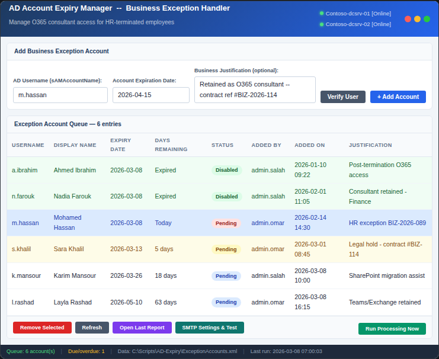
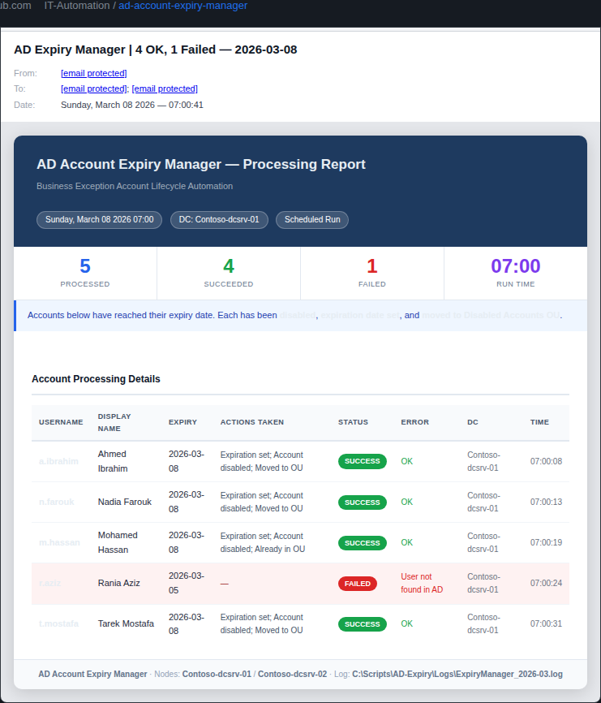
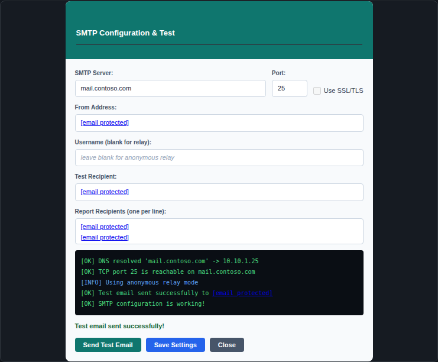

# Ad-Account-Expiry-Manager
PowerShell GUI tool for managing business-exception AD accounts — automates graceful expiry, OU migration, and HTML email reporting for terminated employees retaining O365 access as consultants.

# AD Account Expiry Manager
### Business Exception Handler for Active Directory

[](https://docs.microsoft.com/powershell/)
[](https://www.microsoft.com/windows-server)
[](https://docs.microsoft.com/en-us/powershell/module/activedirectory/)
[](LICENSE)

---

## Overview

**AD Account Expiry Manager** is a PowerShell GUI tool designed to handle a specific and common enterprise challenge: employees who are **terminated in the HR system** but still require **active Microsoft 365 access** for a defined period as consultants, contractors, or during handover transitions.

Without a controlled process, IT teams face two bad options:
- Leave the account fully active (security risk, compliance violation)
- Disable immediately (breaks business continuity, disrupts O365 workflows)

This tool provides a **structured middle ground** — accounts are scheduled for graceful expiry, automatically disabled and moved to a dedicated OU on their expiration date, and stakeholders are notified via a formatted HTML email report.

---

## The Business Problem

```
HR terminates employee  →  Account should be disabled
         ↓
Business still needs O365 access (Teams, Exchange, SharePoint)
         ↓
Exception request raised  →  "Keep active for 60 more days"
         ↓
Who tracks it? Who disables it when the 60 days are up?
```

Without tooling, these exceptions accumulate silently — creating **orphaned privileged accounts**, **compliance audit findings**, and **security gaps**. AD Account Expiry Manager solves this by making the exception lifecycle visible, tracked, and automated.

---

## Screenshots

### GUI Interface — Exception Account Queue



The main window shows all registered exception accounts with colour-coded status rows:

| Row Colour | Meaning |
|---|---|
| 🟢 Green | Account has been successfully disabled |
| 🔴 Red | Expiry date reached — will be processed on next run |
| 🟡 Yellow | Expiring within 7 days — action approaching |
| ⬜ White | Active — more than 7 days remaining |

DC status indicators in the header show live connectivity to both `oc-dcsrv-01` and `oc-dcsrv-02`.

---

### HTML Email Report



Sent automatically after each processing run. Contains:
- Summary stats bar (total processed / succeeded / failed)
- Per-account detail table with actions taken, timestamps, DC used
- Colour-coded SUCCESS / FAILED badges
- Link to local report file and log path

---

### SMTP Settings & Test Dialog



Built-in SMTP configuration and diagnostics panel. Runs three sequential checks:
1. DNS resolution of the mail server
2. TCP connectivity test on the configured port
3. Full SMTP handshake with a live test email

---

## Features

- **GUI Interface** — Windows Forms application, no command-line knowledge needed
- **Dual DC Failover** — Automatically switches from primary to secondary DC if unreachable
- **Scheduled Task Mode** — Run headless with `-Scheduled` flag for daily automation
- **Account Queue** — Persistent XML store of exception accounts with full metadata
- **Auto-Disable** — Disables account, sets AD expiration date, moves to Disabled OU
- **HTML Email Reports** — Rich formatted report sent via SMTP after each processing run
- **Local Report Archive** — HTML reports saved to `Reports\` folder regardless of email status
- **SMTP Diagnostics** — Built-in test tool with DNS/TCP/SMTP step-by-step diagnostics
- **Audit Logging** — Rolling monthly log file with timestamped entries for all actions
- **Input Validation** — Verify user exists in AD before adding to queue
- **PS 5.1 Compatible** — Works on Windows Server 2016/2019/2022 without PowerShell 7

---

## Prerequisites

| Requirement | Details |
|---|---|
| PowerShell | 5.1 or higher |
| OS | Windows Server 2016 / 2019 / 2022 |
| Module | `ActiveDirectory` (RSAT) |
| Permissions | Account Operators or equivalent |
| Network | SMTP relay access for email reports |

Install the ActiveDirectory module if not present:

```powershell
# Windows Server
Install-WindowsFeature RSAT-AD-PowerShell

# Windows 10/11
Add-WindowsCapability -Online -Name Rsat.ActiveDirectory.DS-LDS.Tools~~~~0.0.1.0
```

---

## Quick Start

### 1. Clone the repository

```powershell
git clone https://github.com/YOUR-ORG/ad-account-expiry-manager.git
cd ad-account-expiry-manager
```

### 2. Edit the configuration block

Open `AD-AccountExpiryManager.ps1` and update the `$Global:Config` block at the top:

```powershell
$Global:Config = @{
    PrimaryDC        = "your-dc-01"
    SecondaryDC      = "your-dc-02"
    DisabledOU       = "OU=Disabled Users,DC=contoso,DC=com"
    SMTPServer       = "mail.contoso.com"
    SMTPPort         = 25
    SMTPUseSSL       = $false
    SMTPFrom         = "ad-automation@contoso.com"
    SMTPUser         = ""                    # blank = anonymous relay
    SMTPPass         = ""
    ReportRecipients = @("it-admin@contoso.com", "security@contoso.com")
    DataFile         = "$PSScriptRoot\ExceptionAccounts.xml"
    LogFile          = "$PSScriptRoot\Logs\ExpiryManager_$(Get-Date -f 'yyyy-MM').log"
    ReportDir        = "$PSScriptRoot\Reports"
}
```

### 3. Launch the GUI

```powershell
.\AD-AccountExpiryManager.ps1
```

### 4. Register the Scheduled Task

```powershell
$action  = New-ScheduledTaskAction `
    -Execute "powershell.exe" `
    -Argument "-NonInteractive -ExecutionPolicy Bypass -File `"C:\Scripts\AD-Expiry\AD-AccountExpiryManager.ps1`" -Scheduled"

$trigger = New-ScheduledTaskTrigger -Daily -At "07:00AM"

$principal = New-ScheduledTaskPrincipal `
    -UserId    "CONTOSO\svc-adautomation" `
    -LogonType Password `
    -RunLevel  Highest

Register-ScheduledTask `
    -TaskName   "AD-AccountExpiryManager" `
    -TaskPath   "\IT-Automation\" `
    -Action     $action `
    -Trigger    $trigger `
    -Principal  $principal `
    -Description "Disables business-exception AD accounts on expiry date"
```

---

## Workflow

```
Administrator opens GUI
        ↓
Enters username + expiration date + business justification
        ↓
Clicks "Verify User" → confirms account exists in AD
        ↓
Clicks "+ Add Account" → saved to ExceptionAccounts.xml
        ↓
Scheduled task runs daily at 07:00
        ↓
Script checks: expiry date <= today AND status != Disabled?
        ↓                              ↓
       YES                            NO
        ↓                              ↓
Disable AD account             Skip — log "no accounts due"
Set expiration date
Move to Disabled OU
        ↓
Generate HTML report
Save to Reports\ folder
Send via SMTP
```

---

## File Structure

```
ad-account-expiry-manager/
├── AD-AccountExpiryManager.ps1   # Main script (GUI + scheduled task)
├── ExceptionAccounts.xml         # Auto-generated — persistent account queue
├── README.md
├── LICENSE
├── docs/
│   └── DEPLOYMENT-GUIDE.md      # Step-by-step deployment instructions
├── Logs/
│   └── ExpiryManager_YYYY-MM.log # Auto-generated — monthly rolling log
├── Reports/
│   └── ExpiryReport_*.html       # Auto-generated — HTML processing reports
└── screenshots/
    ├── gui-main.png
    ├── email-report.png
    └── smtp-dialog.png
```

---

## Security Considerations

- The service account running the scheduled task should follow **least privilege** — grant only the permissions needed to disable accounts, set expiration, and move objects within the specific OUs involved
- `SMTPPass` is stored in plaintext in the script — consider using Windows Credential Manager or a secrets vault for production environments
- The `ExceptionAccounts.xml` file contains user account metadata — restrict read access to IT admins only
- All actions are logged with the operator's username (`$env:USERNAME`) for full audit trail

---

## Log Format

```
[2026-03-08 07:00:00] [INFO ] === Scheduled processing started ===
[2026-03-08 07:00:01] [INFO ] Using domain controller: Contoso-dcsrv-01
[2026-03-08 07:00:02] [INFO ] Processing: m.hassan (expiry: 2026-03-08)
[2026-03-08 07:00:05] [INFO ] Expiration set for m.hassan -> 2026-03-08
[2026-03-08 07:00:06] [INFO ] Account disabled: m.hassan
[2026-03-08 07:00:08] [INFO ] Moved m.hassan to OU=Disabled Users,DC=contoso,DC=com
[2026-03-08 07:00:09] [INFO ] Account list saved. Total entries: 6
[2026-03-08 07:00:11] [INFO ] HTML report emailed to: it-admin@contoso.com
[2026-03-08 07:00:11] [INFO ] === Scheduled processing completed. Results: 1 ===
```

---

## Contributing

Pull requests are welcome. For major changes please open an issue first to discuss what you would like to change.

1. Fork the repository
2. Create your feature branch (`git checkout -b feature/your-feature`)
3. Commit your changes (`git commit -m 'Add: your feature description'`)
4. Push to the branch (`git push origin feature/your-feature`)
5. Open a Pull Request

---

## License

MIT License — see [LICENSE](LICENSE) for details.

---

## Author

Built for enterprise AD environments running dual-DC configurations with O365 integration.  
Tested on Windows Server 2019/2022 with PowerShell 5.1 and Exchange Online.
